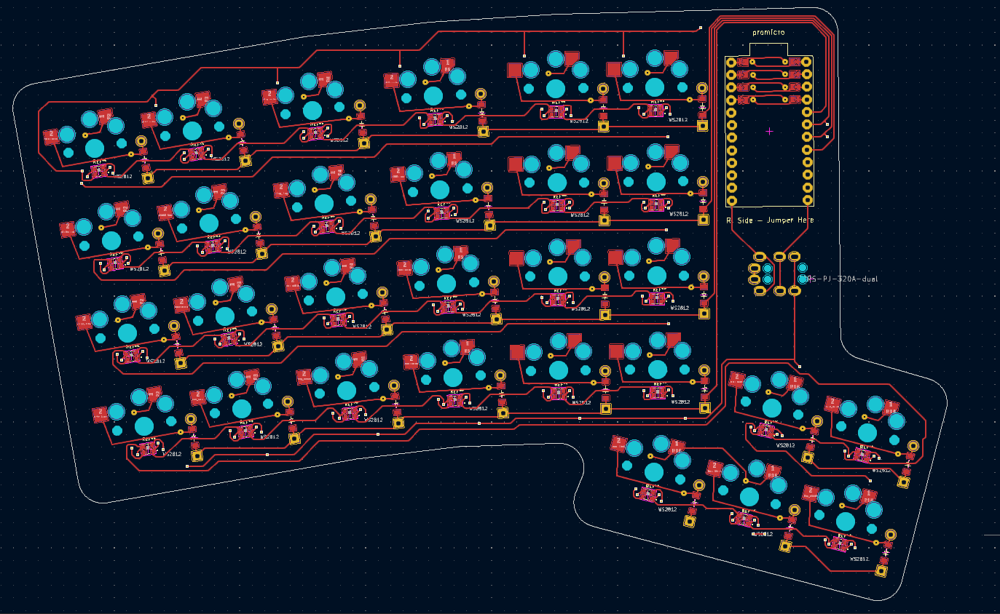

# The Str8-Key Keyboard


## Introduction

Welcome to Str8-Key, a custom mechanical keyboard in both form and function. Co-designed by Ethan Sorensen and John Rowberry, this ortho-linear, staggered, split keyboard is powered by dual Arduino Pro-Micro microcontrollers and connected via USB-C. Str8-Key bridges a fun engineering project with the great configurability of the QMK firmware, the result of which offers a unique and ergonomically safe typing experience! With 58 keys and infinite possibilities, this keyboard can be used to create layouts tailored perfectly to your workflow (or gameflow). Built entirely from scratch, it remains an affordable project at just around $140, excluding 3D printing costs — actually a pretty good price for a fully customized typing experience.

## What You'll find in this Github:

You can look in the Tree.txt file to see a full

## YAML Design

```YAML
metadata:
  engine: 4.0
  version: 1.2
  author: John Rowberry
  contact: johnrowberries@gmail.com
units:
  default_spread: 'cx'
  default_splay: 0
  default_width: 'cy'
  default_padding: 'cx'
  default_autobind: 10
  xspace: cx
  yspace: cy
  paddingy: yspace
...
and more
```

YAML (YAML Ain't Markup Language) is a human-readable data serialization format often used for configuration files. It focuses on simplicity and uses indentation to represent structure, making it easy to read and write. YAML supports key-value pairs, lists, and nested structures, and it's useful to us because Ergogen uses YAML structures to generate layouts for custom keyboards. Look at Flatfox's guide (linked below) for more info on the structure of the YAML code, but its really simple and in most cases you can reference an example like our code and get the right result.

## Board Layout





## Final Product


## Resources we can provide for your own design:

The [**Ergogen guide by FlatFootFox**](https://flatfootfox.com/ergogen-introduction/) was instrumental in helping us bring Str8-Key to life, serving as both a comprehensive resource and our virtual teacher, alongside guidance from **BYU's IEEE Club**. Initially, we used the [**Ergogen Unofficial Website**](https://ergogen.cache.works/), which offers better real-time rendering in some cases compared to the [official site](https://ergogen.xyz/), but we eventually transitioned to running **Ergogen locally on Node**, as suggested in FlatFootFox's guide, for even greater control. [**QMK Firmware**](https://qmk.fm/) was chosen to program the keyboard, and though this is still a work in progress, it offers immense flexibility. Additionally, [**Carter's GitHub**](https://github.com/Virginia2244/BYU-IEEE-Keyboard-Project) project was invaluable, providing a template for the YAML files and saving us on more than one occasion during the build process.

## Resources for the footprint creation and KiCad stuff:

The documentation for the LEDs we chose came from the same **[Adafruit link where we purchased them](https://www.adafruit.com/product/4684)**, and I used this **[SNAP EDA footprint](https://www.snapeda.com/parts/WS2812-2020/Worldsemi/view-part/?company=BYU&)** as a starting point for the Ergogen code found in `footprints/epicpantalones/WS2812`. To ensure the choc switches fit and aligned properly, I referenced this **[choc switch datasheet](https://cdn-shop.adafruit.com/product-files/5113/CHOC+keyswitch_Kailh-CPG135001D01_C400229.pdf)**. The Ergogen code I wrote was primarily based on a guide to **[converting KiCad footprints to Ergogen](https://nilnil.notion.site/Convert-Kicad-Footprints-to-Ergogen-8340ce87ad554c69af4e3f92bc9a0898#03eb03c468ba49feabb4847096c0ff94)**, with some additional reference from this **[LED code](https://github.com/infused-kim/kb_ergogen_fp/blob/main/smd_0805.js)** that I used as a basis.

## The actual parts that we purchased:

We ordered the PCB from **[JLCPCB](https://jlcpcb.com/)**, and the price was incredibly affordable at just $13 plus shipping, totaling about $30 for five boards. The keys cost around $50, depending on the type, and we opted for **[frosted black choc switch keycaps](https://a.co/d/dT4MgD5)**, as the frosted look let the RGB lighting through. The LEDs were sourced from **[Adafruit](https://www.adafruit.com/product/4684)**. Our controller head unit is the **[Arduino Pro Micro](https://www.sparkfun.com/products/12640)**, a board we discovered during this project, and they are connected via an audio connector (links forthcoming). We also included hot-swap sockets for the choc switches, which makes customization easy, and control flow diodes, although we don't have the sourcing details or costs for those at the moment.